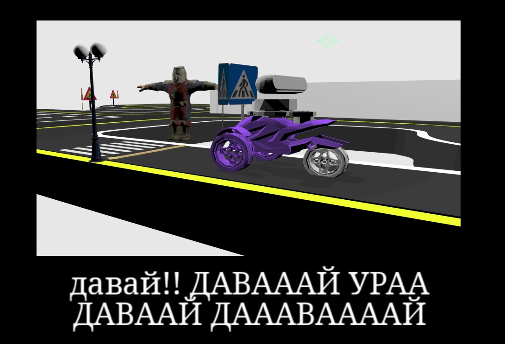

# AutoRace 2024, команда ROSticks<!--, какжевсёзадолбало эдишен-->



Идея в том, что пакет с роботом, его датчиками, трассой, и т.д. уже настроены и написаны за нас, и, пользуясь тем, что дают, нужно написать пакет, который позволил бы роботу проехать как можно больше (хотя бы два) испытания.

Репозиторий с пакетами AutoRace: https://github.com/virusapex/my_robot/tree/competition

Гугл док с описанием каждого испытания и правилами соревнования: https://docs.google.com/document/u/0/d/1sQG8y7XGYGjq9g8EpqIKAqsGXEpJOtXgXYXiI4EAVy0/mobilebasic?pli=1 (вход с @g.nsu.ru)

Если что, все пакеты я уже собрал здесь, то есть из репозитория выше непрямую ставить ничего не надо. 

# Перед началом работы…

0. Очевидно, установить [ROS2 Humble](https://docs.ros.org/en/humble/Installation/Ubuntu-Install-Debs.html) (я использую [воркспейс ros2_ws](https://docs.ros.org/en/foxy/Tutorials/Beginner-Client-Libraries/Creating-A-Workspace/Creating-A-Workspace.html#new-directory) из туториала), [RViz](https://docs.ros.org/en/humble/Tutorials/Intermediate/RViz/RViz-User-Guide/RViz-User-Guide.html#install-or-build-rviz) и [Gazebo (у меня Fortress)](https://gazebosim.org/docs/harmonic/install_ubuntu/#binary-installation-on-ubuntu). Что интересно и печально, в WSL2 мне нормально всё это дело завести так и не удалось, мням.

1. Клонируем (именно через git, а не просто скачать .zip с гитхаба, чтобы потом не было попаболи с разницой версий) эту ветку этого репозитория, кладём её куда-нибудь куда удобно.

2. Переходим в папку с проектом, фетчим сабмодули, делаем симлинк папки в src:
```bash
git submodule update --init --recursive
source ~/ros2_ws/install/setup.bash
ln -s "$(pwd)" ~/ros2_ws/src/my_robot
```

3. Ставим зависимости и собираем все пакеты – cделать это нужно всего один раз, далее мы будем собирать только пакет с управлением роботом через всё тот же симлинк:
```bash
cd ~/ros2_ws/src
rosdep install --from-paths my_robot --os ubuntu:jammy \
--ignore-src -r -i -y --rosdistro humble
cd ..
colcon build --packages-select referee_console robot_bringup robot_description
```

4. Проверим, что всё работает:
```bash
source install/setup.bash
ros2 launch robot_bringup autorace_2023.launch.py
```

5. Теперь можно спокойно редачить модуль `autorace_core_ROSticks` прямо внутри этой папки, никуда его всё время не копируя, а затем собирать следующим образом:
```bash
cd ~/ros2_ws && colcon build --packages-select autorace_core_ROSticks && source ~/ros2_ws/install/setup.bash
```

6. По правилам из гугл дока, запуск соревнования должен выглядеть строго вот так:

- **Терминал 1:** `ros2 launch robot_bringup autorace_2023.launch.py`
  <br>(иницализация трассы, робота и всей связанной с ними шушары)

- **Терминал 2:** `ros2 launch autorace_core_ROSticks autorace_core.launch`
  <br>(запуск нашего пакета управления роботом)

- **Терминал 3:** `ros2 run referee_console mission_autorace_2023_referee`
  <br>(скрипт на запуск таймера и подсчета времени)

Для удобства можно использовать скриптик для TMUX, который делает ровно то же самое, плюс автоматически компилирует последнюю версию пакета `autorace_core_ROSticks`:
```bash
chmod +x ./pognali.sh
./pognali.sh
```
Но можно и просто открыть три вкладки в терминале и вручную туда копипастить.

*Ну, в общем-то всё :)*
